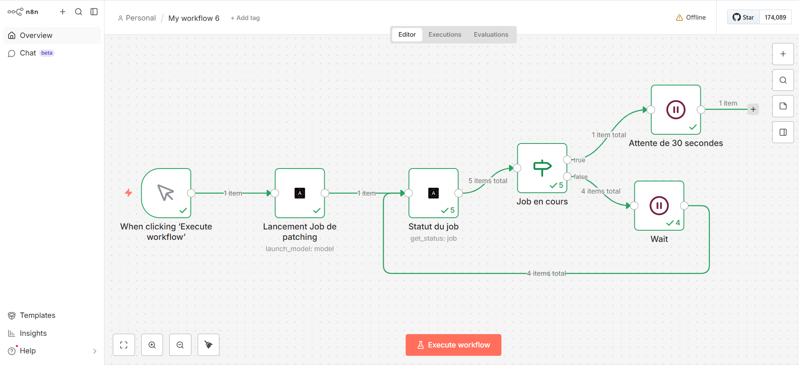

# n8n-nodes-ansible-automation-platform

<a href="https://www.loom.com/share/d3148f4da40440fc81863acecfd8c0e0" target="_blank">Vidéo</a>

# n8n-nodes-ansible-automation-platform

This node allows you to interact with the **RedHat Ansible Automation Platform (AAP)** API directly within your n8n workflows. It simplifies launching job templates and monitoring their execution status.

## 🚀 Features

### **Model Management**

* **Launch**: Trigger a specific Job Template with custom variables (Extravars).
* **Dynamic Fetching**: Automatically lists available templates from your instance using a dynamic dropdown (via `loadOptions`).

### **Job Management**

* **Get Status**: Retrieve the real-time progress of a job and its complete output (**stdout**) in JSON format.

---

## ⚙️ Requirements

### Authentication

The node supports two authentication methods, to be configured in the **Credentials** section of n8n:

1. **Basic Auth**: Uses a username and password (via `ansibleAutomationPlatformApi`).
2. **OAuth2**: Uses an Access Token for enhanced security (via `ansibleAutomationPlatformTokenApi`).

> [!TIP]
> **Domain Configuration:** You must provide the base URL of your instance (e.g., `https://ansible.your-company.com`). The node automatically handles the removal of any trailing slashes.

---

## 🛠 Usage

### 1. Launch a Model (Launch Model)

1. Select the **Model** resource.
2. Choose the **Launch** operation.
3. Select the desired model from the dropdown list (names are fetched in real-time from your AAP instance).
4. *(Optional)* Add extra variables in the **Extravars In JSON Format** field.
* Example: `{"target_host": "webserver01", "action": "update"}`

### 2. Monitor a Job (Get Status)

1. Select the **Job** resource.
2. Choose the **Get Status** operation.
3. Enter the **Job ID** (usually retrieved from the output of a previous "Launch" step).
4. The node will return an object containing:
* `job`: Full execution metadata (status, timestamps, etc.).
* `stdout`: The complete console output formatted as JSON.

---

## 📦 Installation (Developer)

If you are installing this node manually:

1. Clone the repository.
2. Compile the TypeScript code: `npm run build`.
3. Copy the generated files into your custom nodes folder:
`~/.n8n/nodes/custom/`
4. Ensure the `AnsibleAutomationPlatform_logo.svg` file is present in the folder.
5. Restart n8n.

---

## ⚠️ Common Errors

* **401 Unauthorized**: Check your credentials or ensure your OAuth2 token has sufficient permissions to access Job Templates.
* **Connection Refused**: Verify that the AAP instance is reachable from your n8n server (check firewalls or VPN settings).
* **JSON Parsing Error**: The `Extravars` field must be a valid JSON object. Avoid trailing commas at the end of the object.

---

**Would you like me to create a "Quick Start" JSON workflow snippet that you can include in the README for users to copy and paste?**
